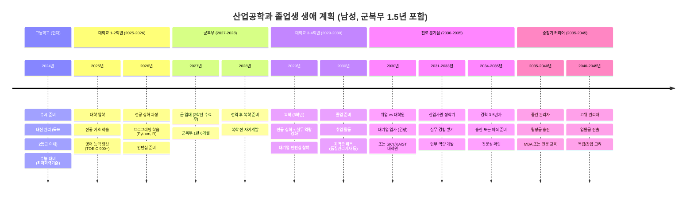
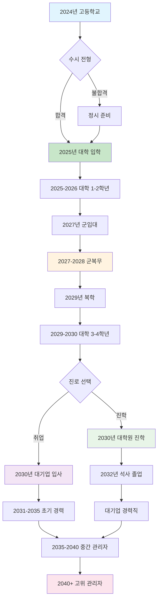
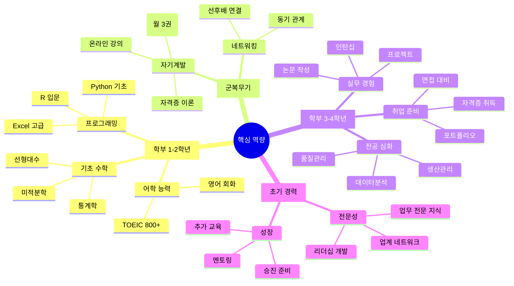
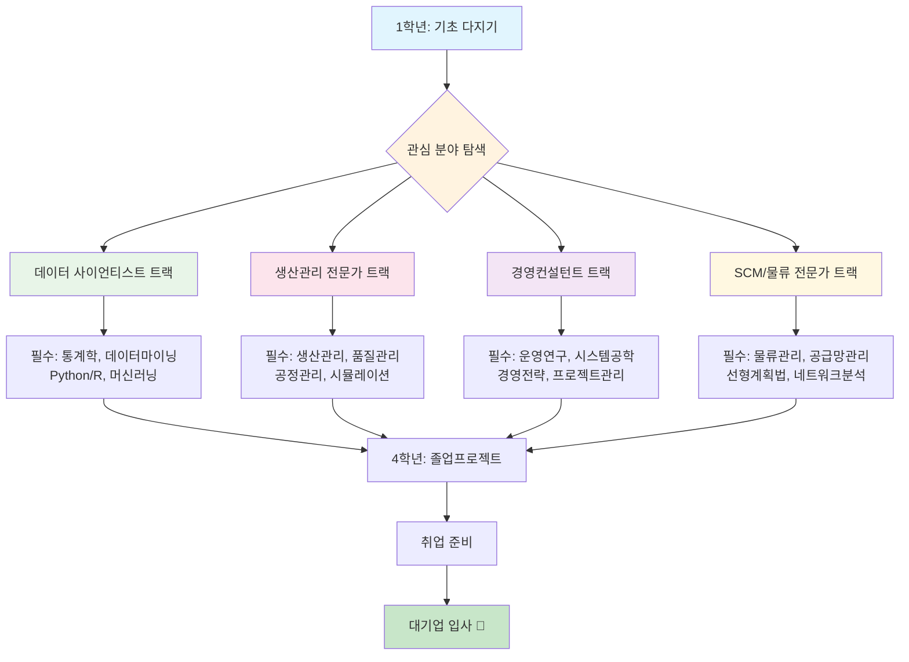
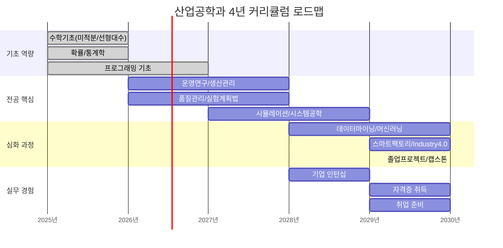
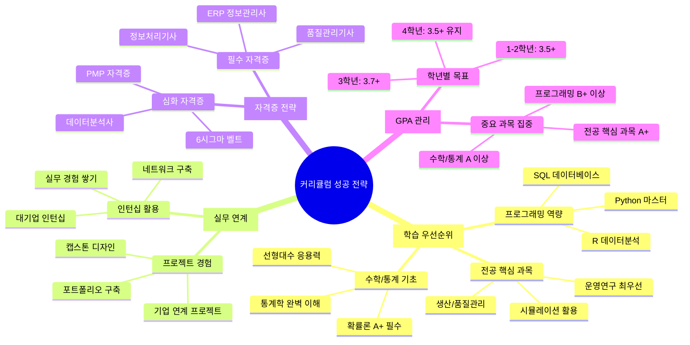

# 수시 대학 선택 가이드: 산업공학과 전략적 분석

> **목표**: 건국대, 동국대, 부산대 중 취업 중심 **최적 2개 대학** 선별
> 
> **우선순위**: 취업률 > 대학원 진학 > 경제적 효율성 > 접근성

## 🏆 최종 추천: 1순위 부산대, 2순위 건국대

### 📋 추천 근거 요약
| 구분 | 부산대학교 | 건국대학교 | 동국대학교 |
|------|------------|------------|------------|
| **취업률** | 90%+ (★★★) | 69.2% (★★☆) | 미확보 (★☆☆) |
| **대기업 취업** | 절대다수 (★★★) | 49% (★★☆) | 미확보 (★☆☆) |
| **대학 위상** | 지방 거점 국립대 (★★★) | 서울 중위권 (★★☆) | 서울 중견급 (★☆☆) |
| **입학 난이도** | 2등급 초중반 (★★★) | 2.11등급 (★★☆) | 2.07-3.40등급 (★★☆) |
| **경제성** | 국립대 (★★★) | 사립대 (★☆☆) | 사립대 (★☆☆) |
| **종합 점수** | **13/15** | **9/15** | **6/15** |

---

## 📊 상세 분석 결과

### 🥇 1순위: 부산대학교 산업공학과
#### ✅ 선택 이유
- **압도적 취업률**: 공과대학 매년 **90% 이상** 취업률
- **취업 품질**: 절대다수가 **대기업/공기업** 취업  
- **지역할당제 혜택**: 부산/경남 지역 기업 채용 시 우대
- **경제적 효율성**: 국립대학 **저렴한 등록금** (사립대 1/3 수준)
- **합리적 진입**: 2등급 초중반으로 상대적 안정적 진입

#### 🎯 핵심 강점
- **산업 연계성**: 부산/경남 제조업, 조선업, 화학업 집중지역
- **물류 허브**: 부산항 중심 동북아 물류 거점 활용
- **안정적 교육**: 정부 지원 기반 지속가능한 교육환경
- **실무 중심**: 지역 산업체와 활발한 산학협력

#### ⚠️ 고려사항  
- **지역 제한**: 서울 중심 기업 취업 시 상대적 불리
- **네트워크**: 서울 소재 인맥 구축의 한계

---

### 🥈 2순위: 건국대학교 산업공학과  
#### ✅ 선택 이유
- **서울 접근성**: 서울 소재로 기업 네트워크 구축 유리
- **공대 취업률**: 공과대학 **대기업 취업률 49%** 양호한 수준
- **다양한 트랙**: 5개 전공트랙으로 진로 선택권 넓음
- **중위권 안정성**: 서울 소재 중위권 대학으로 안정적 위치

#### 🎯 핵심 강점
- **위치적 이점**: 강남권 위치로 기업 접근성 우수
- **교육과정**: 생산시스템, 의사결정, 금융, IT 등 종합교육
- **네트워크**: 서울 소재 대학 동문 네트워크
- **진로 다양성**: 제조업부터 IT, 금융까지 폭넓은 진출

#### ⚠️ 고려사항
- **경쟁률**: 서울 소재로 상대적 높은 경쟁률  
- **등록금**: 사립대학 높은 등록금 부담

---

### 🥉 3순위: 동국대학교 (선택 제외)
#### ❌ 제외 이유
- **데이터 부족**: 구체적 취업률, 대기업 취업 현황 미확보
- **상대적 위상**: 3개 대학 중 가장 낮은 순위
- **명확한 장점 부족**: 타 대학 대비 특별한 차별화 요소 부족

---

## 🗓️ 인생 설계 로드맵 (군복무 1.5년 포함)

---

## 📈 연도별 상세 실행 계획

### Phase별 상세 로드맵

### 월별 세부 실행 계획 (고3 기준)

```mermaid
gantt
    title 2024년 수시 준비 월별 계획
    dateFormat  MM
    axisFormat  %m월

    section 학습관리
    내신 1학기 관리    :done, grade1, 03, 07
    내신 2학기 관리    :grade2, 09, 12
    수능 최저 준비     :test, 03, 11

    section 서류준비
    자기소개서 작성    :essay, 04, 08
    추천서 의뢰       :rec, 05, 07
    서류 최종 점검    :review, 08, 09

    section 전형일정
    수시 원서 접수    :crit, apply, 09, 09
    면접/논술 준비    :interview, 09, 11
    수시 결과 발표    :result, 12, 12
```

### Phase 1: 대학 준비기 (2024년)
- **우선 목표**: 부산대 수시 합격
- **필수 준비사항**:
  - 내신 2등급 이내 유지
  - 수능 최저학력기준 충족 (영어 2등급, 수학/탐구 등급별 확인)
  - 학교 활동 및 봉사활동 참여
- **지원 전략**: 부산대 1순위, 건국대 2순위 지원

### Phase 2: 대학 초기 (2025-2026년)
- **학업 목표**: GPA 3.8/4.5 이상 유지
- **역량 개발**:
  - 영어: TOEIC 900점 이상
  - 컴퓨터: Python, R, SQL 기초
  - 통계: 기초통계학, 회귀분석
- **활동**: 학과 동아리, 프로젝트 팀 참여

### Phase 3: 군복무기 (2027-2028년)  
- **자기계발**: 독서, 온라인 강의 수강
- **네트워크**: 동기들과 지속적 연락
- **준비**: 복학 후 계획 수립

### Phase 4: 대학 후기 (2029-2030년)
- **목표**: 대기업 취업 또는 명문 대학원 진학
- **준비사항**:
  - 자격증: 품질관리기사, 정보처리기사
  - 인턴십: 대기업 또는 유명 기업 인턴
  - 졸업논문: 실무 적용 가능한 주제 선정

### Phase 5: 초기 경력 (2030-2035년)
- **취업 목표**: 삼성, LG, 현대차, SK 등 대기업
- **직무 분야**: 생산관리, 품질관리, 데이터분석, 경영기획
- **역량 개발**: 실무 전문성, 리더십, 업계 네트워크

### 핵심 역량 개발 로드맵

---

## 💡 성공 전략 가이드

### 🎯 대학 선택 전략
1. **부산대 우선 지원**: 경제성 + 취업률 + 안정성
2. **건국대 복수 지원**: 서울 접근성 + 네트워크 혜택  
3. **내신 관리 철저**: 2등급 이내 목표로 꾸준한 관리
4. **수능 최저 반드시 충족**: 각 대학별 최저기준 사전 확인

### 📚 대학 생활 전략
1. **GPA 관리**: 대학원 진학 대비 3.8/4.5 이상 유지
2. **실무 역량**: 프로그래밍, 데이터분석, 통계 등  
3. **어학 능력**: TOEIC 900+, 비즈니스 영어 소통 능력
4. **네트워킹**: 선배, 교수님, 동기들과의 관계 구축

### 💼 취업 준비 전략  
1. **인턴십 필수**: 대기업 인턴십을 통한 실무 경험
2. **자격증 취득**: 품질관리기사, 정보처리기사 등
3. **포트폴리오**: 프로젝트 경험, 문제해결 사례 정리
4. **면접 준비**: 산업공학 전공 지식 + 실무 적용 능력

---

## ⚡ 최종 제언

### 🔥 핵심 메시지
> **부산대학교를 1순위로 강력 추천합니다.**
> 
> 90% 이상의 취업률과 대기업/공기업 취업 우위, 그리고 국립대학으로서의 경제적 효율성은 다른 어떤 대학도 따라올 수 없는 압도적 장점입니다.

### 🏃‍♂️ 실행 우선순위
1. **즉시**: 내신 성적 점검 및 목표 등급 설정 (2등급 이내)
2. **1개월 내**: 수능 최저학력기준 확인 및 대비 계획 수립  
3. **수시 접수 전**: 자기소개서 및 학교 활동 점검
4. **합격 후**: 전공 기초 학습 및 진로 구체화 시작

### 🎓 장기적 관점
산업공학과는 **제조업 강국 한국에서 가장 실용적이고 안정적인 공학 분야** 중 하나입니다. 특히 부산대학교는 지역 산업과의 연계성, 경제적 효율성, 높은 취업률을 모두 갖춘 **최적의 선택**입니다.

---

## 🌟 산업공학과 출신 성공 인물들

### 주요 대기업 CEO 현황

산업공학과는 **"공대 안의 경영학과"**라고 불리며, 수많은 최고경영자를 배출해온 CEO의 요람입니다.

#### 🏆 대표 성공 인물

**📱 김범수 - 카카오 의장 (서울대 산업공학과)**
- 국민 메신저 '카카오톡' 성공 주역
- 기업가치 1,000억원 → 13조원으로 130배 성장 달성
- 플랫폼 생태계 구축의 선구자

**🚗 하언태 - 현대자동차 대표이사 (아주대 산업공학과)**
- 30년간 현대차 생산 전문가로 성장
- 현재 현대차 국내생산 총괄 사장
- 울산공장 등 국내 제조 혁신 주도

**📱 고동진 - 삼성전자 공동 대표이사 (성균관대 산업공학과)**
- 폴더블폰 신 폼팩터 개발 선도
- 글로벌 스마트폰 시장 혁신 주역
- 기술과 마케팅 융합 전문가

**📞 권봉석 - LG전자 CEO (서울대 산업공학과)**
- 1987년 LG전자 입사, 33년간 성장
- 디지털 전환 전문가 (AI, 빅데이터, 커넥티비티)
- LG전자 글로벌 IT기업 전환 리더

### 🔥 산업공학과 CEO 전성시대

> **"ICT 업계에 산업공학과 출신 CEO 전성시대가 열렸다"**
> 
> 기술(IT)과 경영을 모두 배우는 융합 학문으로, 통섭과 융합의 시대에 최적화된 인재들이 각 산업 분야를 이끌고 있습니다.

#### 성공 요인 분석
- **융합적 사고**: 기술 + 경영의 완벽한 결합
- **시스템적 관점**: 전체를 보는 거시적 안목  
- **최적화 역량**: 복잡한 문제의 체계적 해결
- **시대 적합성**: 4차 산업혁명, 디지털 전환 시대의 핵심 역량

**여러분도 이들처럼 대한민국 산업을 이끄는 리더가 될 수 있습니다! 🌟**

---

## 📚 산업공학과 커리큘럼 완전 분석

### 💎 핵심 필수 교과목 (90%+ 대학 공통)

산업공학과 성공의 핵심은 **수학/통계 기초 + 경영마인드 + IT 활용능력** 삼박자입니다.

#### 🔢 기초 역량 (1-2학년)
- **확률론 & 통계학** (★★★★★) - 모든 분야의 기초
- **프로그래밍** (Python/R) (★★★★★) - 4차 산업혁명 필수
- **선형대수 & 공업수학** (★★★★☆) - 최적화 이론 기반
- **경영학원론** (★★★★☆) - 경영마인드 구축

#### 🏭 전공 핵심 (2-3학년)  
- **운영연구** (★★★★★) - 산업공학의 핵심
- **생산관리** (★★★★★) - 제조업 필수 역량
- **품질관리** (★★★★★) - 품질경영 전문성
- **시뮬레이션** (★★★★☆) - 시스템 모델링
- **실험계획법** (★★★☆☆) - 데이터 기반 의사결정

#### 🚀 미래 대비 (3-4학년)
- **데이터마이닝** (★★★★★) - 빅데이터 시대 핵심
- **머신러닝** (★★★★☆) - AI 융합 역량
- **스마트팩토리** (★★★☆☆) - Industry 4.0 대비
- **인간공학** (★★★☆☆) - UX/UI 설계 기초

### 🎯 진로별 커리큘럼 로드맵

### 📊 학년별 세부 커리큘럼 계획

### 🏆 성공적인 이수를 위한 핵심 전략

### 💼 졸업 후 진로 연계 분석

| 진로 분야 | 필수 이수 과목 | 추천 자격증 | 연봉 수준 | 성장성 |
|-----------|----------------|-------------|-----------|---------|
| **데이터 사이언티스트** | 통계학, 데이터마이닝, Python | 데이터분석사, SQL | 5,500만원 | ★★★★★ |
| **생산관리 전문가** | 생산관리, 품질관리, IE기법 | 품질관리기사, 6시그마 | 4,800만원 | ★★★★☆ |
| **경영컨설턴트** | 운영연구, 경영전략, 프로젝트관리 | PMP, MBA | 6,200만원 | ★★★★★ |
| **SCM/물류 전문가** | 물류관리, 공급망관리, 최적화 | 유통관리사, SCM | 4,500만원 | ★★★★☆ |

### 🎓 대학별 커리큘럼 특화 전략

#### 부산대학교 (1순위 추천) 
- **특화 분야**: 제조업 연계 실무 교육
- **추천 이수**: 생산관리, 품질관리, 공정관리 집중
- **지역 연계**: 부산/경남 제조업체 인턴십 적극 활용
- **성공 포인트**: 실무 프로젝트 + 산업체 네트워킹

#### 건국대학교 (2순위 추천)
- **특화 분야**: IT/금융 융합 교육
- **추천 이수**: 데이터마이닝, 금융공학, IT시스템 집중  
- **서울 연계**: 강남권 IT기업 인턴십 기회 활용
- **성공 포인트**: 프로그래밍 역량 + 서울 네트워킹

### 🔑 커리큘럼 성공의 핵심 원칙

> **1순위**: 수학/통계 기초를 탄탄히! (확률론, 통계학 A+ 목표)
>
> **2순위**: 프로그래밍은 생존 스킬! (Python, R 완벽 습득)  
>
> **3순위**: 실무 경험이 경쟁력! (인턴십, 프로젝트 필수)
>
> **4순위**: 자격증으로 전문성 증명! (품질관리기사, 데이터분석사)

---

## 📁 참고 자료
- [건국대학교 상세 분석](raw/universities/konkuk_university.md)
- [동국대학교 상세 분석](raw/universities/dongguk_university.md)  
- [부산대학교 상세 분석](raw/universities/pusan_national_university.md)
- [산업공학과 커리큘럼 완전 분석](raw/curriculum/industrial_engineering_curriculum.md) 🔥
- [2024년 대기업 채용 현황](raw/employment/major_companies_2024.md)
- [산업공학과 진로 가이드](raw/career_paths/industrial_engineering_careers.md)
- [산업공학과 성공 인물 분석](raw/career_paths/successful_alumni.md) 🆕
- [2024년 대학 순위](raw/rankings/university_rankings_2024.md)
- [2025년 입시 요강](raw/admissions/admission_requirements_2025.md)