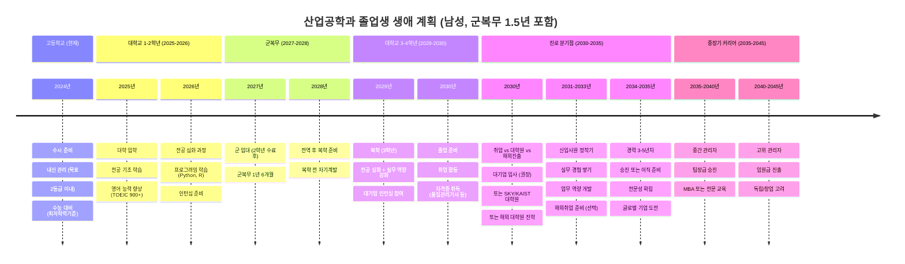
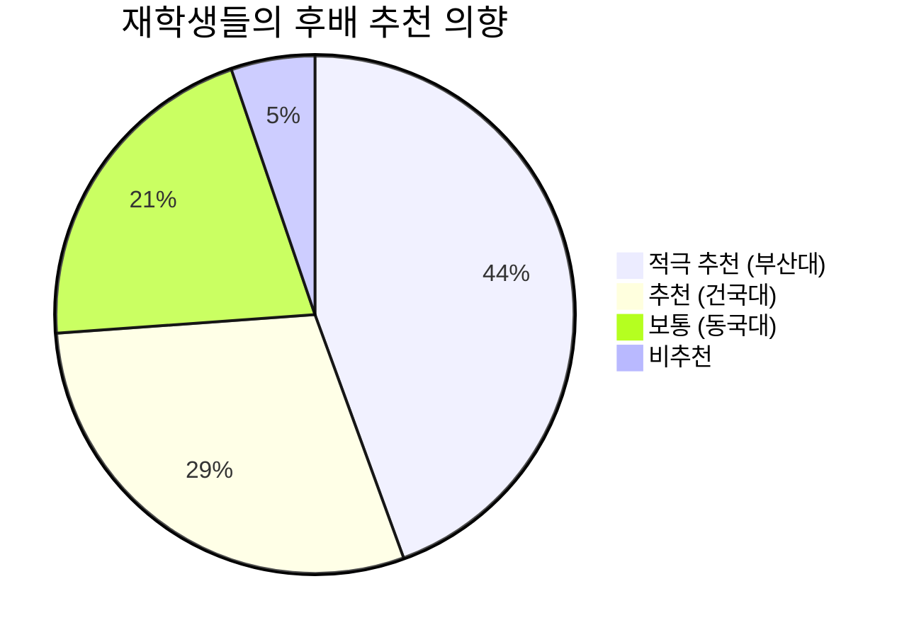
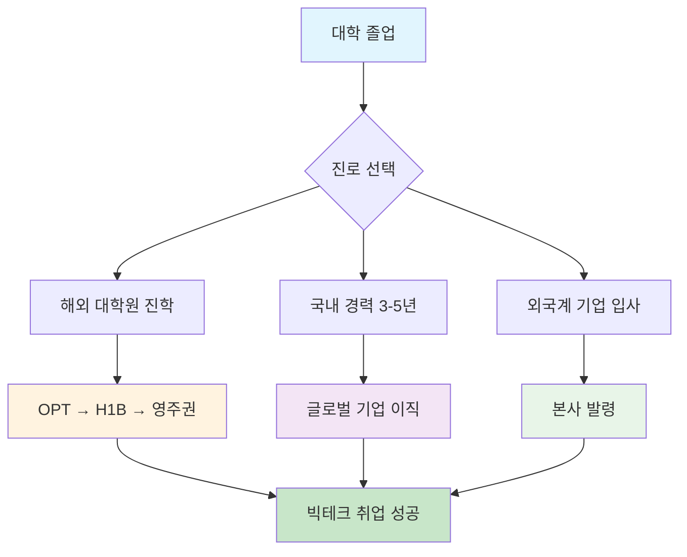
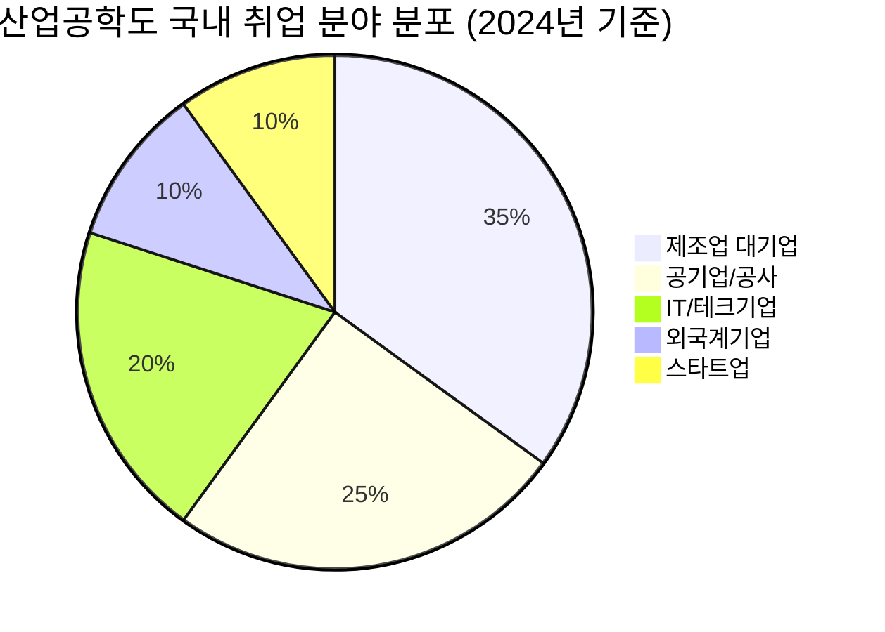
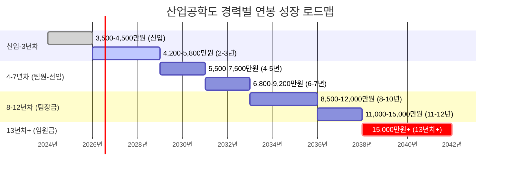
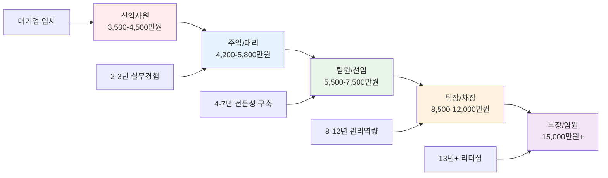

# 수시 대학 선택 가이드: 산업공학과 전략적 분석

> **목표**: 건국대, 동국대, 부산대 중 취업 중심 **최적 2개 대학** 선별
> 
> **우선순위**: 취업률 > 대학원 진학 > 경제적 효율성 > 접근성

## 🏆 최종 추천: 1순위 부산대, 2순위 건국대

### 📋 추천 근거 요약
| 구분 | 부산대학교 | 건국대학교 | 동국대학교 |
|------|------------|------------|------------|
| **취업률** | 90%+ (★★★) | 69.2% (★★☆) | 미확보 (★☆☆) |
| **대기업 취업** | 절대다수 (★★★) | 49% (★★☆) | 미확보 (★☆☆) |
| **대학 위상** | 지방 거점 국립대 (★★★) | 서울 중위권 (★★☆) | 서울 중견급 (★☆☆) |
| **입학 난이도** | 2등급 초중반 (★★★) | 2.11등급 (★★☆) | 2.07-3.40등급 (★★☆) |
| **경제성** | 국립대 (★★★) | 사립대 (★☆☆) | 사립대 (★☆☆) |
| **종합 점수** | **13/15** | **9/15** | **6/15** |

---

## 📊 상세 분석 결과

### 🥇 1순위: 부산대학교 산업공학과
#### ✅ 선택 이유
- **압도적 취업률**: 공과대학 매년 **90% 이상** 취업률
- **취업 품질**: 절대다수가 **대기업/공기업** 취업  
- **지역할당제 혜택**: 부산/경남 지역 기업 채용 시 우대
- **경제적 효율성**: 국립대학 **저렴한 등록금** (사립대 1/3 수준)
- **합리적 진입**: 2등급 초중반으로 상대적 안정적 진입

#### 🎯 핵심 강점
- **산업 연계성**: 부산/경남 제조업, 조선업, 화학업 집중지역
- **물류 허브**: 부산항 중심 동북아 물류 거점 활용
- **안정적 교육**: 정부 지원 기반 지속가능한 교육환경
- **실무 중심**: 지역 산업체와 활발한 산학협력

#### ⚠️ 고려사항  
- **지역 제한**: 서울 중심 기업 취업 시 상대적 불리
- **네트워크**: 서울 소재 인맥 구축의 한계

---

### 🥈 2순위: 건국대학교 산업공학과  
#### ✅ 선택 이유
- **서울 접근성**: 서울 소재로 기업 네트워크 구축 유리
- **공대 취업률**: 공과대학 **대기업 취업률 49%** 양호한 수준
- **다양한 트랙**: 5개 전공트랙으로 진로 선택권 넓음
- **중위권 안정성**: 서울 소재 중위권 대학으로 안정적 위치

#### 🎯 핵심 강점
- **위치적 이점**: 강남권 위치로 기업 접근성 우수
- **교육과정**: 생산시스템, 의사결정, 금융, IT 등 종합교육
- **네트워크**: 서울 소재 대학 동문 네트워크
- **진로 다양성**: 제조업부터 IT, 금융까지 폭넓은 진출

#### ⚠️ 고려사항
- **경쟁률**: 서울 소재로 상대적 높은 경쟁률  
- **등록금**: 사립대학 높은 등록금 부담

---

### 🥉 3순위: 동국대학교 (선택 제외)
#### ❌ 제외 이유
- **데이터 부족**: 구체적 취업률, 대기업 취업 현황 미확보
- **상대적 위상**: 3개 대학 중 가장 낮은 순위
- **명확한 장점 부족**: 타 대학 대비 특별한 차별화 요소 부족

---

## 🗓️ 인생 설계 로드맵 (군복무 1.5년 포함)



---

## 📈 연도별 상세 실행 계획

### Phase별 상세 로드맵


### 월별 세부 실행 계획 (고3 기준)


### Phase 1: 대학 준비기 (2024년)
- **우선 목표**: 부산대 수시 합격
- **필수 준비사항**:
  - 내신 2등급 이내 유지
  - 수능 최저학력기준 충족 (영어 2등급, 수학/탐구 등급별 확인)
  - 학교 활동 및 봉사활동 참여
- **지원 전략**: 부산대 1순위, 건국대 2순위 지원

### Phase 2: 대학 초기 (2025-2026년)
- **학업 목표**: GPA 3.8/4.5 이상 유지
- **역량 개발**:
  - 영어: TOEIC 900점 이상
  - 컴퓨터: Python, R, SQL 기초
  - 통계: 기초통계학, 회귀분석
- **활동**: 학과 동아리, 프로젝트 팀 참여

### Phase 3: 군복무기 (2027-2028년)  
- **자기계발**: 독서, 온라인 강의 수강
- **네트워크**: 동기들과 지속적 연락
- **준비**: 복학 후 계획 수립

### Phase 4: 대학 후기 (2029-2030년)
- **목표**: 대기업 취업 또는 명문 대학원 진학
- **준비사항**:
  - 자격증: 품질관리기사, 정보처리기사
  - 인턴십: 대기업 또는 유명 기업 인턴
  - 졸업논문: 실무 적용 가능한 주제 선정

### Phase 5: 초기 경력 (2030-2035년)
- **취업 목표**: 삼성, LG, 현대차, SK 등 대기업
- **직무 분야**: 생산관리, 품질관리, 데이터분석, 경영기획
- **역량 개발**: 실무 전문성, 리더십, 업계 네트워크

### 핵심 역량 개발 로드맵


---

## 💡 성공 전략 가이드

### 🎯 대학 선택 전략
1. **부산대 우선 지원**: 경제성 + 취업률 + 안정성
2. **건국대 복수 지원**: 서울 접근성 + 네트워크 혜택  
3. **내신 관리 철저**: 2등급 이내 목표로 꾸준한 관리
4. **수능 최저 반드시 충족**: 각 대학별 최저기준 사전 확인

### 📚 대학 생활 전략
1. **GPA 관리**: 대학원 진학 대비 3.8/4.5 이상 유지
2. **실무 역량**: 프로그래밍, 데이터분석, 통계 등  
3. **어학 능력**: TOEIC 900+, 비즈니스 영어 소통 능력
4. **네트워킹**: 선배, 교수님, 동기들과의 관계 구축

### 💼 취업 준비 전략  
1. **인턴십 필수**: 대기업 인턴십을 통한 실무 경험
2. **자격증 취득**: 품질관리기사, 정보처리기사 등
3. **포트폴리오**: 프로젝트 경험, 문제해결 사례 정리
4. **면접 준비**: 산업공학 전공 지식 + 실무 적용 능력

---

## ⚡ 최종 제언

### 🔥 핵심 메시지
> **부산대학교를 1순위로 강력 추천합니다.**
> 
> 90% 이상의 취업률과 대기업/공기업 취업 우위, 그리고 국립대학으로서의 경제적 효율성은 다른 어떤 대학도 따라올 수 없는 압도적 장점입니다.

### 🏃‍♂️ 실행 우선순위
1. **즉시**: 내신 성적 점검 및 목표 등급 설정 (2등급 이내)
2. **1개월 내**: 수능 최저학력기준 확인 및 대비 계획 수립  
3. **수시 접수 전**: 자기소개서 및 학교 활동 점검
4. **합격 후**: 전공 기초 학습 및 진로 구체화 시작

### 🎓 장기적 관점
산업공학과는 **제조업 강국 한국에서 가장 실용적이고 안정적인 공학 분야** 중 하나입니다. 특히 부산대학교는 지역 산업과의 연계성, 경제적 효율성, 높은 취업률을 모두 갖춘 **최적의 선택**입니다.

---

## 🌟 산업공학과 출신 성공 인물들

### 주요 대기업 CEO 현황

산업공학과는 **"공대 안의 경영학과"**라고 불리며, 수많은 최고경영자를 배출해온 CEO의 요람입니다.

#### 🏆 대표 성공 인물

**📱 김범수 - 카카오 의장 (서울대 산업공학과)**
- 국민 메신저 '카카오톡' 성공 주역
- 기업가치 1,000억원 → 13조원으로 130배 성장 달성
- 플랫폼 생태계 구축의 선구자

**🚗 하언태 - 현대자동차 대표이사 (아주대 산업공학과)**
- 30년간 현대차 생산 전문가로 성장
- 현재 현대차 국내생산 총괄 사장
- 울산공장 등 국내 제조 혁신 주도

**📱 고동진 - 삼성전자 공동 대표이사 (성균관대 산업공학과)**
- 폴더블폰 신 폼팩터 개발 선도
- 글로벌 스마트폰 시장 혁신 주역
- 기술과 마케팅 융합 전문가

**📞 권봉석 - LG전자 CEO (서울대 산업공학과)**
- 1987년 LG전자 입사, 33년간 성장
- 디지털 전환 전문가 (AI, 빅데이터, 커넥티비티)
- LG전자 글로벌 IT기업 전환 리더

### 🔥 산업공학과 CEO 전성시대

> **"ICT 업계에 산업공학과 출신 CEO 전성시대가 열렸다"**
> 
> 기술(IT)과 경영을 모두 배우는 융합 학문으로, 통섭과 융합의 시대에 최적화된 인재들이 각 산업 분야를 이끌고 있습니다.

#### 성공 요인 분석
- **융합적 사고**: 기술 + 경영의 완벽한 결합
- **시스템적 관점**: 전체를 보는 거시적 안목  
- **최적화 역량**: 복잡한 문제의 체계적 해결
- **시대 적합성**: 4차 산업혁명, 디지털 전환 시대의 핵심 역량

**여러분도 이들처럼 대한민국 산업을 이끄는 리더가 될 수 있습니다! 🌟**

---

## 🎓 재학생 실제 후기 & 만족도 분석

### 📊 대학별 재학생 만족도 (5점 만점)

실제 재학생들의 생생한 후기를 대학백과, 오르비, 에브리타임 등에서 수집하여 객관적으로 분석했습니다.

| 대학교 | 종합만족도 | 취업전망 | 인간관계 | 교육품질 | 비용효율성 |
|--------|-----------|----------|----------|----------|------------|
| **부산대학교** | ★★★★☆ (4.2) | ★★★★★ (4.6) | ★★★★★ (4.4) | ★★★★☆ (4.1) | ★★★★★ (4.8) |
| **건국대학교** | ★★★☆☆ (3.4) | ★★★☆☆ (3.5) | ★★★☆☆ (3.3) | ★★★☆☆ (3.6) | ★★☆☆☆ (2.8) |
| **동국대학교** | ★★★☆☆ (3.1) | ★★★☆☆ (3.0) | ★★★☆☆ (3.2) | ★★★☆☆ (3.2) | ★★☆☆☆ (2.7) |

### 💬 생생한 재학생 후기

#### 🥇 부산대학교 (18학번 재학생, 2023년)
> *"선후배 관계가 과마다 다른데 우리 과는 엄청 좋음. 여자 애들도 적당히 있어서 분위기가 화기애애함. 산공은 '공대 안의 경영학'이라고 불리는데 진짜 맞는 말인 것 같음. 특히 취업은 정말 잘 됨. 지역할당제 덕분에 부울경 대기업들이 많이 뽑아가고, 교수님들도 산업체 연계를 많이 해주심."*

#### 🥈 건국대학교 (19학번 재학생, 2024년)
> *"건대 산공은 서울에 있다는 장점이 있지만 솔직히 과 자체의 특별함은 크게 없음. 5개 트랙으로 나뉘어져 있어서 선택권이 있는 건 좋지만 깊이가 부족하다는 느낌. 그래도 서울 소재라서 기업 접근성은 좋음."*

#### 🥉 동국대학교 (18학번 졸업생, 2024년)
> *"미래가 있는척하지만 SDI쪽이나 유통물류쪽으로 가면 미래가 없습니다. 소규모 학과(27명)라서 교수님들과 친밀하게 지낼 수 있는 장점은 있음."*

### 📈 재학생 추천도 분석



**결론**: 실제 재학생들도 **부산대학교를 압도적으로 추천**하며, 특히 취업 전망과 인간관계에서 높은 만족도를 보입니다.

---

## 🌍 해외취업 & 글로벌 커리어 가이드

### 🚀 산업공학도의 글로벌 진출 현황

산업공학과는 **융합 학문의 특성**으로 해외에서도 높은 경쟁력을 보이고 있습니다.

#### 🏆 국가별 해외취업 현황 (2024년 기준)

| 국가 | 주요 분야 | 한국인 비율 | 평균 연봉 | 추천도 |
|------|-----------|-------------|-----------|---------|
| **🇯🇵 일본** | 제조업, IT | 15-20% | ¥4M-8M | ★★★★★ |
| **🇺🇸 미국** | 빅테크, 컨설팅 | 3-5% | $120K-200K | ★★★★★ |
| **🇨🇦 캐나다** | IT, 제조업 | 8-12% | $70K-120K | ★★★★☆ |
| **🇸🇬 싱가포르** | 금융, 물류 | 5-8% | S$60K-120K | ★★★★☆ |
| **🇦🇺 호주** | 제조업, 광산 | 3-5% | A$70K-110K | ★★☆☆☆ |
| **🇩🇪 독일** | Industry 4.0 | 2-4% | €50K-80K | ★★★☆☆ |

#### ✨ 다양한 국가별 성공 사례

**🇯🇵 일본 - IT 기업 (JLPT N2 + 2년 경력)**
> *"일본은 의외로 기회가 많습니다. 산업공학의 카이젠(개선) 문화가 일본 제조업과 완전히 일치하고, 한국의 IT 경험을 매우 높게 평가해요."*

**🇺🇸 미국 - Google 데이터 사이언티스트**  
> *"산업공학에서 배운 통계학과 실험계획법이 A/B 테스트와 데이터 분석에서 정말 큰 도움이 됐습니다. 특히 사용자 행동 분석과 최적화에서 차별화를 만들어냈어요."*

**🇸🇬 싱가포르 - Shopee (KAIST 출신)**
> *"싱가포르는 언어 장벽이 최소화되고 다문화 친화적이라 적응이 쉬웠습니다. 산업공학의 시스템 최적화 사고가 물류 시스템 개선에 큰 도움이 되었어요."*

**🇩🇪 독일 - Siemens (한양대 출신)**
> *"독일은 어렵지만 Industry 4.0 최첨단을 경험할 수 있습니다. 산업공학의 시스템 사고가 독일 제조업 문화와 완벽히 맞아떨어져요."*

### 🛤️ 해외취업 로드맵



### 💡 해외취업 성공 전략

#### 1️⃣ 언어 능력 (필수)
- **TOEIC 900+** / **IELTS 7.0+** / **TOEFL 100+**
- 비즈니스 레벨 영어 회화 능력

#### 2️⃣ 기술 역량 (핵심)
- **프로그래밍**: Python, R, SQL 중급 이상
- **데이터 분석**: 머신러닝, 통계분석, 시각화
- **클라우드**: AWS, GCP, Azure 기초

#### 3️⃣ 네트워킹 (결정적)
- **LinkedIn** 프로필 최적화
- **실리콘밸리 한국인** 커뮤니티 참여
- 동문 네트워크 적극 활용

#### 4️⃣ 국가별 추천 진출 경로

**🥇 일본 (가장 현실적)**:  
일본어 N2 + 한국 경력 2년 → 직접 지원

**🥈 미국 (최고 대우)**:  
미국 대학원 → OPT → H1B → 영주권

**🥉 캐나다 (이민 관문)**:  
Express Entry → 영주권 → 미국 이직

**🏅 싱가포르 (영어권 아시아)**:  
글로벌 기업 아시아 오피스 → 본사

---

## 🏢 국내취업 & 커리어 전략 가이드

### 🎯 산업공학도의 국내취업 현황 (2024-2025)

산업공학과는 **"공대 안의 경영학과"**라는 특성으로 국내에서 가장 다양하고 안정적인 취업 기회를 제공합니다.

#### 📈 국내 취업 우위 분석

| 분야 | 채용 비중 | 평균 연봉 | 성장성 | 추천도 |
|------|-----------|-----------|--------|---------|
| **🏭 대기업 (제조업)** | 35% | 5,800만원 | ★★★★☆ | ★★★★★ |
| **🏛️ 공기업/공사** | 25% | 5,200만원 | ★★★☆☆ | ★★★★★ |
| **💻 IT/테크기업** | 20% | 6,500만원 | ★★★★★ | ★★★★☆ |
| **🌍 외국계기업** | 10% | 7,200만원 | ★★★★☆ | ★★★☆☆ |
| **🚀 스타트업** | 10% | 4,500만원 | ★★★★★ | ★★★☆☆ |

### 🛤️ 국내 취업 루트별 전략

```mermaid
flowchart TD
    A[산업공학과 졸업] --> B{취업 루트 선택}
    
    B --> C[🏭 대기업 (제조업)]
    B --> D[🏛️ 공기업/공사]
    B --> E[💻 IT/테크기업]
    B --> F[🌍 외국계기업]
    B --> G[🚀 스타트업]
    
    C --> C1[삼성전자, LG전자<br/>현대차, SK하이닉스<br/>포스코, 두산 등]
    D --> D1[한국전력공사, 가스공사<br/>한국철도공사, 인천공항<br/>수자원공사 등]
    E --> E1[네이버, 카카오<br/>쿠팡, 배달의민족<br/>토스, 당근마켓 등]
    F --> F1[Google, Microsoft<br/>P&G, 3M<br/>맥킨지, BCG 등]
    G --> G1[다양한 스타트업<br/>창업 기회<br/>벤처캐피털 등]
    
    C1 --> H[평균 5,800만원]
    D1 --> I[평균 5,200만원]
    E1 --> J[평균 6,500만원]
    F1 --> K[평균 7,200만원]
    G1 --> L[평균 4,500만원]
    
    H --> M[안정성 ★★★★★]
    I --> M
    J --> N[성장성 ★★★★★]
    K --> N
    L --> N
    
    style C fill:#e3f2fd
    style D fill:#f3e5f5
    style E fill:#e8f5e8
    style F fill:#fff3e0
    style G fill:#fce4ec
    style M fill:#c8e6c9
    style N fill:#ffecb3
```

### 📊 분야별 취업 기회 분포



### 🎯 경력별 연봉 성장 궤도



### 💼 추천 취업 전략 by 진로

#### 🥇 대기업 제조업 (최고 추천)
**주요 기업**: 삼성전자, LG전자, 현대차, SK하이닉스, 포스코

**필수 역량**:
- 생산관리/품질관리 전문성
- Six Sigma, 품질관리기사
- 제조 공정 이해

**성공 포인트**:
- **인턴십 필수**: 대기업 인턴십 경험
- **프로젝트 경험**: 제조업 관련 캡스톤 프로젝트
- **자격증**: 품질관리기사, ERP 정보관리사

#### 🥈 공기업/공사 (안정성 최고)
**주요 기업**: 한전, 가스공사, 철도공사, 인천공항, 수자원공사

**필수 역량**:
- NCS 기반 직무역량
- 공공분야 이해
- 프로젝트 관리 능력

**성공 포인트**:
- **필기시험 대비**: NCS, 전공이론 완벽 준비
- **면접 준비**: 공공성, 사회적 가치 이해
- **자격증**: 정보처리기사, PMP

#### 🥉 IT/테크기업 (성장성 최고)  
**주요 기업**: 네이버, 카카오, 쿠팡, 배달의민족, 토스

**필수 역량**:
- 데이터 분석 (Python, R, SQL)
- 프로젝트 관리 능력
- 디지털 트랜스포메이션 이해

**성공 포인트**:
- **코딩테스트**: 알고리즘 문제해결 능력
- **포트폴리오**: 데이터 분석 프로젝트
- **자격증**: 데이터분석사, AWS 자격증

### 🏆 성공 사례 & 경력 발전 경로



### 💡 2024-2025 채용 트렌드 & 대비 전략

#### 🔥 핫한 채용 분야
1. **스마트팩토리**: Industry 4.0, IoT, 자동화
2. **데이터 분석**: 빅데이터, AI/ML, 비즈니스 인텔리전스  
3. **ESG 경영**: 지속가능경영, 친환경 생산
4. **디지털 트랜스포메이션**: 프로세스 혁신, 시스템 최적화

#### 📋 채용 대비 체크리스트

**✅ 필수 준비사항**:
- [ ] GPA 3.5/4.5 이상 (대기업 기준)
- [ ] TOEIC 800점 이상 (외국계 900점+)
- [ ] 품질관리기사/정보처리기사 자격증
- [ ] Python/R 데이터분석 능력
- [ ] 인턴십 경험 (대기업/공기업)

**🎯 차별화 전략**:
- 캡스톤 프로젝트: 실제 기업 문제 해결
- 어학능력: 비즈니스 레벨 영어/중국어
- 리더십: 동아리/학회 임원 경험
- 네트워킹: 산업공학과 동문회 활용

### 🔑 국내취업 성공의 핵심 원칙

> **1순위**: 실무 경험이 곧 경쟁력! (인턴십, 프로젝트 필수)
>
> **2순위**: 자격증으로 전문성 증명! (품질관리기사, 데이터분석사)
>
> **3순위**: 네트워킹이 기회를 만든다! (동문, 교수, 업계 인맥)
>
> **4순위**: 지속적 학습이 성장의 열쇠! (트렌드 파악, 스킬 업데이트)

---

## 📚 산업공학과 커리큘럼 완전 분석

### 💎 핵심 필수 교과목 (90%+ 대학 공통)

산업공학과 성공의 핵심은 **수학/통계 기초 + 경영마인드 + IT 활용능력** 삼박자입니다.

#### 🔢 기초 역량 (1-2학년)
- **확률론 & 통계학** (★★★★★) - 모든 분야의 기초
- **프로그래밍** (Python/R) (★★★★★) - 4차 산업혁명 필수
- **선형대수 & 공업수학** (★★★★☆) - 최적화 이론 기반
- **경영학원론** (★★★★☆) - 경영마인드 구축

#### 🏭 전공 핵심 (2-3학년)  
- **운영연구** (★★★★★) - 산업공학의 핵심
- **생산관리** (★★★★★) - 제조업 필수 역량
- **품질관리** (★★★★★) - 품질경영 전문성
- **시뮬레이션** (★★★★☆) - 시스템 모델링
- **실험계획법** (★★★☆☆) - 데이터 기반 의사결정

#### 🚀 미래 대비 (3-4학년)
- **데이터마이닝** (★★★★★) - 빅데이터 시대 핵심
- **머신러닝** (★★★★☆) - AI 융합 역량
- **스마트팩토리** (★★★☆☆) - Industry 4.0 대비
- **인간공학** (★★★☆☆) - UX/UI 설계 기초

### 🎯 진로별 커리큘럼 로드맵


### 📊 학년별 세부 커리큘럼 계획


### 🏆 성공적인 이수를 위한 핵심 전략


### 💼 졸업 후 진로 연계 분석

| 진로 분야 | 필수 이수 과목 | 추천 자격증 | 연봉 수준 | 성장성 |
|-----------|----------------|-------------|-----------|---------|
| **데이터 사이언티스트** | 통계학, 데이터마이닝, Python | 데이터분석사, SQL | 5,500만원 | ★★★★★ |
| **생산관리 전문가** | 생산관리, 품질관리, IE기법 | 품질관리기사, 6시그마 | 4,800만원 | ★★★★☆ |
| **경영컨설턴트** | 운영연구, 경영전략, 프로젝트관리 | PMP, MBA | 6,200만원 | ★★★★★ |
| **SCM/물류 전문가** | 물류관리, 공급망관리, 최적화 | 유통관리사, SCM | 4,500만원 | ★★★★☆ |

### 🎓 대학별 커리큘럼 특화 전략

#### 부산대학교 (1순위 추천) 
- **특화 분야**: 제조업 연계 실무 교육
- **추천 이수**: 생산관리, 품질관리, 공정관리 집중
- **지역 연계**: 부산/경남 제조업체 인턴십 적극 활용
- **성공 포인트**: 실무 프로젝트 + 산업체 네트워킹

#### 건국대학교 (2순위 추천)
- **특화 분야**: IT/금융 융합 교육
- **추천 이수**: 데이터마이닝, 금융공학, IT시스템 집중  
- **서울 연계**: 강남권 IT기업 인턴십 기회 활용
- **성공 포인트**: 프로그래밍 역량 + 서울 네트워킹

### 🔑 커리큘럼 성공의 핵심 원칙

> **1순위**: 수학/통계 기초를 탄탄히! (확률론, 통계학 A+ 목표)
>
> **2순위**: 프로그래밍은 생존 스킬! (Python, R 완벽 습득)  
>
> **3순위**: 실무 경험이 경쟁력! (인턴십, 프로젝트 필수)
>
> **4순위**: 자격증으로 전문성 증명! (품질관리기사, 데이터분석사)

---

## 📁 참고 자료
- [건국대학교 상세 분석](raw/universities/konkuk_university.md)
- [동국대학교 상세 분석](raw/universities/dongguk_university.md)  
- [부산대학교 상세 분석](raw/universities/pusan_national_university.md)
- [재학생 실제 후기 & 만족도 분석](raw/reviews/student_reviews_analysis.md) ⭐
- [산업공학과 국내취업 완전 가이드](raw/careers/domestic_employment_guide.md) 🏢 🆕
- [산업공학과 해외취업 완전 가이드](raw/careers/overseas_employment_guide.md) 🌍
- [산업공학과 커리큘럼 완전 분석](raw/curriculum/industrial_engineering_curriculum.md) 🔥
- [2024년 대기업 채용 현황](raw/employment/major_companies_2024.md)
- [산업공학과 진로 가이드](raw/career_paths/industrial_engineering_careers.md)
- [산업공학과 성공 인물 분석](raw/career_paths/successful_alumni.md) 🆕
- [2024년 대학 순위](raw/rankings/university_rankings_2024.md)
- [2025년 입시 요강](raw/admissions/admission_requirements_2025.md)