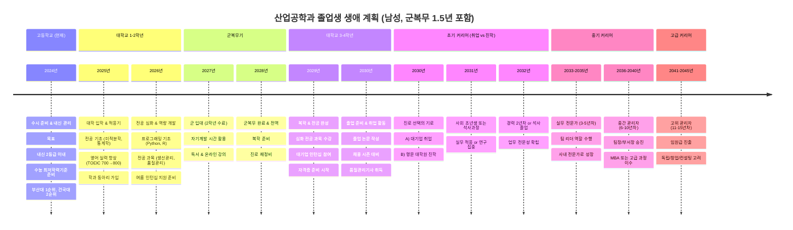
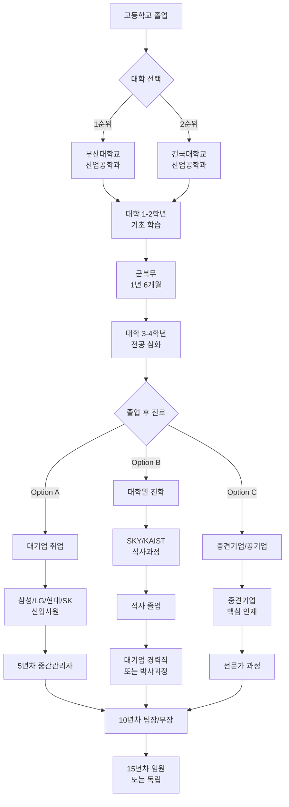
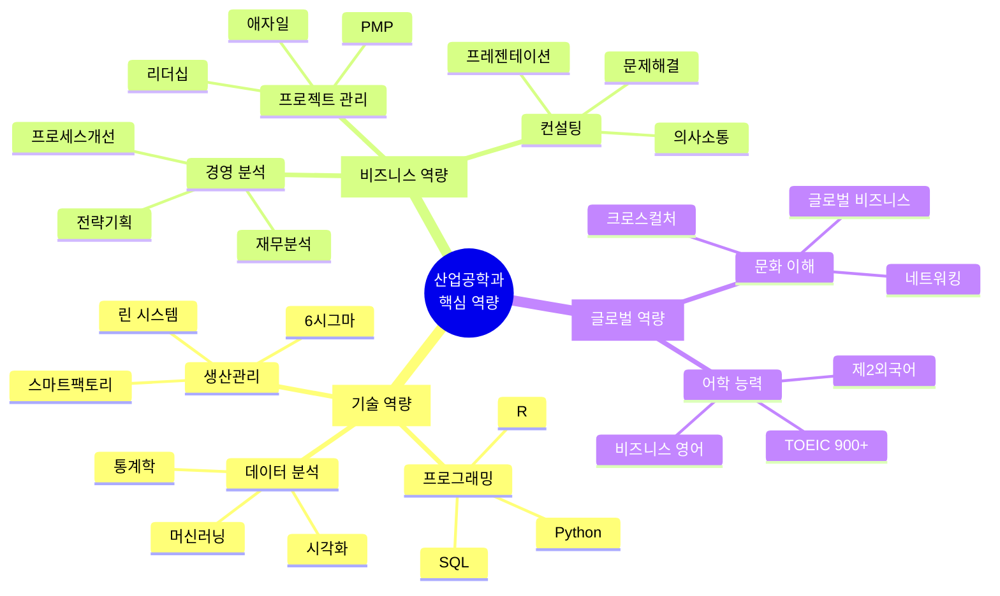
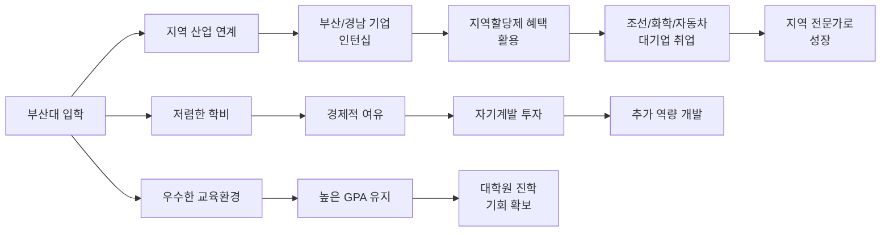
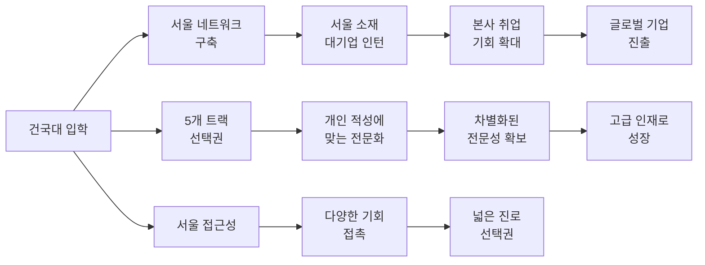
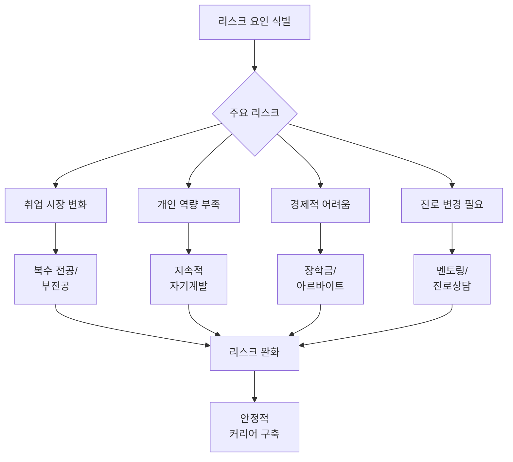
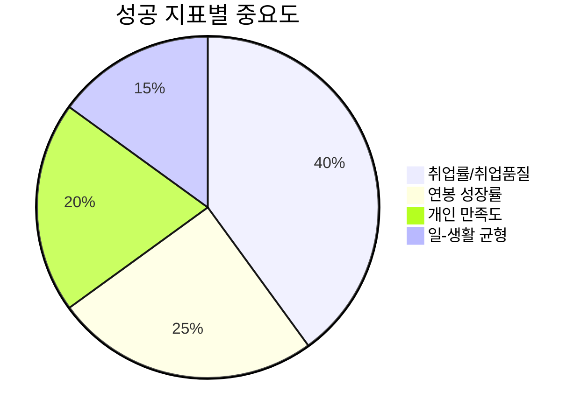

# 산업공학과 인생 설계 다이어그램

## 전체 생애 로드맵 (2024-2045, 21년간)



## 세부 진로 분기 다이어그램



## 연봉 성장 곡선 다이어그램

```mermaid
xychart-beta
    title "산업공학과 연봉 성장 곡선 (단위: 만원)"
    x-axis [신입, 3년차, 5년차, 7년차, 10년차, 15년차]
    y-axis "연봉" 0 --> 15000
    bar [3800, 5500, 7000, 9000, 12000, 15000]
```

## 핵심 역량 개발 로드맵



## 대학별 특화 전략

### 부산대학교 선택 시 전략



### 건국대학교 선택 시 전략



## 리스크 관리 전략



## 성공 KPI 지표



---

## 다이어그램 활용 가이드

### 1. 전체 로드맵 활용
- **단계별 점검**: 매년 말 자신의 위치 확인
- **목표 수정**: 환경 변화에 따른 계획 조정
- **성과 측정**: KPI 지표 기반 성과 평가

### 2. 분기점 의사결정
- **취업 vs 진학**: 개인 성향과 시장 상황 고려
- **대기업 vs 중견기업**: 안정성 vs 성장가능성 비교
- **지역 vs 수도권**: 라이프스타일과 가치관 고려

### 3. 역량 개발 우선순위
- **1-2학년**: 기초 역량 (영어, 프로그래밍, 전공기초)
- **3-4학년**: 실무 역량 (인턴십, 프로젝트, 자격증)
- **직장인**: 전문 역량 (MBA, 고급과정, 리더십)

### 4. 네트워킹 전략
- **대학 시절**: 선후배, 교수님 관계 구축
- **군복무**: 다양한 배경 동기들과 인맥 형성
- **직장 생활**: 업계 전문가, 멘토 관계 발전